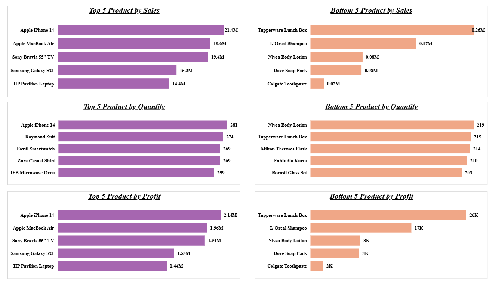
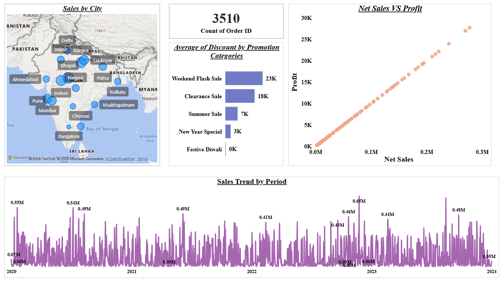
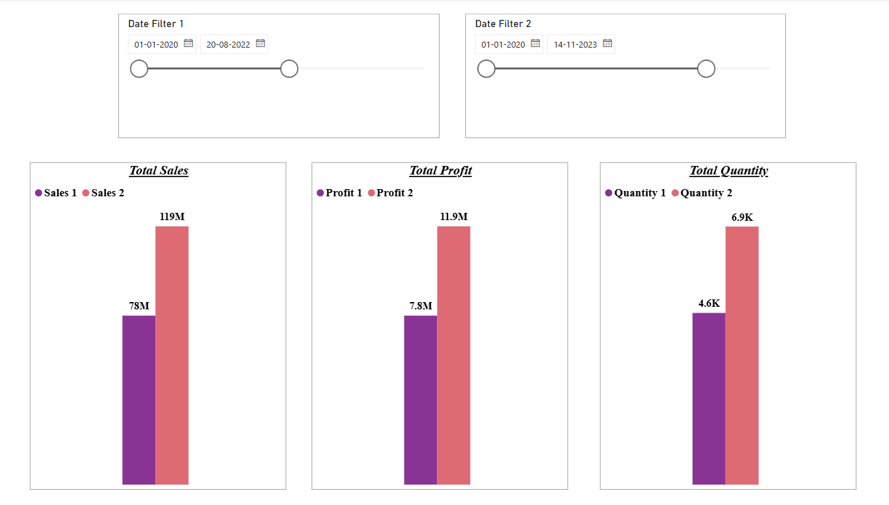
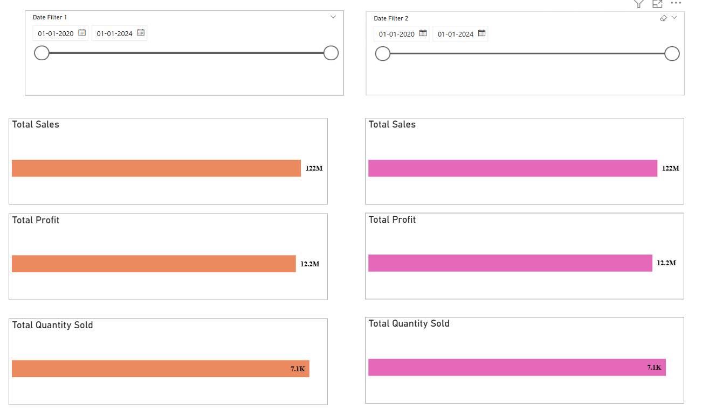
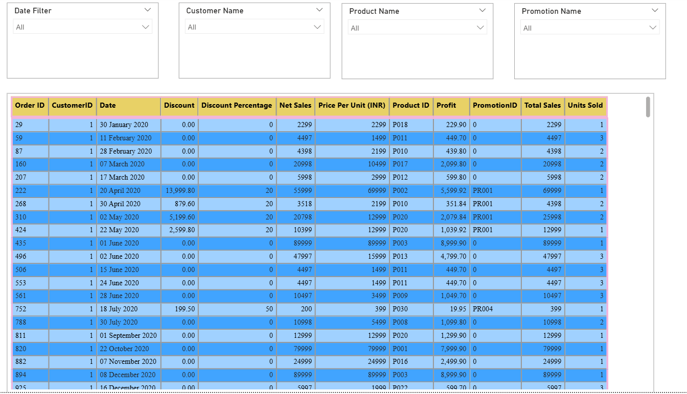
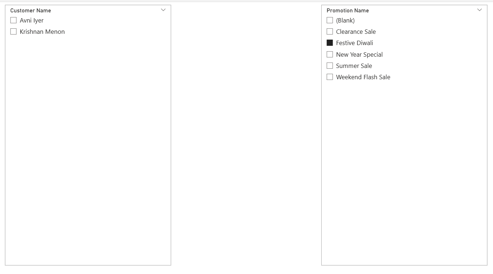

# 📊 Sales Analytics Dashboard using Power BI


---

## 📌 Project Overview

This project presents an **interactive Sales Analytics Dashboard** built using **Power BI** to analyze business sales performance across products, cities, promotions, and time periods for an India-based retail store.

The project combines:
- 📊 **Power BI** — 6 interactive business intelligence dashboard pages
- 🧮 **DAX (Data Analysis Expressions)** — Custom measures and calculations
- ☁️ **Power BI Service** — Cloud deployment for online access & sharing
- 🗂️ **Star Schema Data Model** — Efficient relational data structure with role-playing dimensions

> The dataset covers transactional sales data from **January 2020 to November 2023**, analyzed in Power BI to produce insights across product performance, regional sales, promotion effectiveness, and profitability.

---

## 🎯 Project Objectives

This project answers key business questions such as:

- Which products generate the **highest and lowest sales, profit, and quantity sold**?
- Which **cities and regions** contribute the most sales volume?
- How effective are **different promotion categories** in driving discounts?
- What is the relationship between **net sales and profit**?
- How does sales performance **compare across two custom time periods**?
- What are the **sales trends over time** from 2020 to 2024?

---

## 📊 Dashboard Screenshots

### 1. Top and Bottom 5 Analysis


### 2. Overview Dashboard


### 3. Comparison Dashboard


### 4. Interactive Filter Analysis


### 5. Transaction Table View


### 6. Filter Analysis Page


---

## 🛠️ Tools & Technologies

| Tool | Purpose |
|---|---|
| Power BI Desktop | Dashboard development & visualization |
| DAX (Data Analysis Expressions) | Custom measures and calculations |
| Power BI Service | Cloud publishing & sharing |
| Star Schema | Efficient relational data modeling |
| Excel (.xlsx) | Source dataset |

---

## ⚙️ How to Use

### Step 1 — Clone the Repository
```bash
git clone https://github.com/abhi14324/sales-analytics-dashboard.git
cd sales-analytics-dashboard
```

### Step 2 — Open Power BI Dashboard
1. Open `Sales_Analytics_Dashboard.pbix` in **Power BI Desktop**
2. Click **Home → Refresh** to load the latest data from `Store_Dataset.xlsx`
3. Explore all 6 dashboard pages using the slicers and date filters

### Step 3 — View Live Dashboard
Click the Power BI Service link below to access the published report online without Power BI Desktop.

---

## 📁 Project Structure

```
sales-analytics-dashboard/
│
├── Sales_Analytics_Dashboard.pbix         ← Power BI report file
│
├── Store_Dataset.xlsx                     ← Source dataset
│
├── screenshots/
│   ├── Top_and_Bottom_5_Analysis.png
│   ├── overview_dashboard.png
│   ├── Comparison_Dashboard.png
│   ├── Interactive_Filter_Analysis.png
│   ├── Transaction_Table_View.png
│   └── Filter_Analysis_Page.png
│
└── README.md
```

---

## 📋 Data Model

The dashboard follows a **star schema** with the following tables:

| Table | Type | Key Fields |
|---|---|---|
| Fact Table | Fact | Order ID, Customer ID, Product ID, Promotion ID, Net Sales, Total Sales, Profit, Units Sold, Discount, Date |
| Dim Customers | Dimension | Customer ID, Customer Name |
| Dim Product | Dimension | Product ID, Product Name, Category |
| Dim Promotion | Dimension | Promotion ID, Promotion Name, Discount Type |
| Date Table 1 | Date | Date (Primary — used for default filtering) |
| Date Table 2 | Date | Date (Secondary — used for period comparison) |
| Measure Table | Measures | All DAX measures centralized here |

> **Role-Playing Dimensions:** Two separate Date Tables are used so users can independently filter two time periods simultaneously. `Date Table 2` uses an **inactive relationship** activated via `USERELATIONSHIP()` in DAX.

---

## 📈 Power BI Dashboard Pages

### Page 1 — Top and Bottom 5 Analysis
> Best and worst performing products across all key metrics

**Visuals:**
- Top 5 Products by Sales (Bar Chart)
- Bottom 5 Products by Sales (Bar Chart)
- Top 5 Products by Quantity Sold (Bar Chart)
- Bottom 5 Products by Quantity Sold (Bar Chart)
- Top 5 Products by Profit (Bar Chart)
- Bottom 5 Products by Profit (Bar Chart)

**Key Insights:**
- 🏆 Apple iPhone 14 is the top product by sales (21.4M), profit (2.14M), and quantity (281 units)
- ⚠️ Tupperware Lunch Box is the lowest performer across all three metrics
- 📱 Electronics dominate the Top 5 in both sales and profit

---

### Page 2 — Overview Dashboard
> High-level business performance summary

**KPI Cards:** Total Orders · Total Sales · Total Profit · Total Quantity

**Visuals:**
- Sales by City (Map Visual — India)
- Count of Order ID (Card)
- Average Discount by Promotion Category (Bar Chart)
- Net Sales vs Profit (Scatter Plot)
- Sales Trend by Period (Area / Bar Chart — 2020 to 2024)

**Key Insights:**
- 🗺️ Metro cities (Delhi, Mumbai, Bangalore) drive major sales volume
- 🎟️ Weekend Flash Sale offers the highest average discount (23K avg)
- 📈 Strong positive linear relationship between Net Sales and Profit
- 3,510 total orders processed across the full period

---

### Page 3 — Comparison Dashboard (Sales / Profit / Quantity)
> Side-by-side comparison of two user-selected time periods

**Slicers:** Date Filter 1 · Date Filter 2 (independent period selection)

**Visuals:**
- Total Sales — Period 1 vs Period 2 (Bar Chart)
- Total Profit — Period 1 vs Period 2 (Bar Chart)
- Total Quantity Sold — Period 1 vs Period 2 (Bar Chart)

**Key Insights:**
- Enables flexible period-over-period benchmarking
- Uses `USERELATIONSHIP()` DAX pattern for independent date control

---

### Page 4 — Interactive Filter Analysis
> Demonstrates cross-filter behavior between visuals

**Slicers:** Date Filter 1 · Date Filter 2

**Visuals:**
- Total Sales (Dual Period)
- Total Profit (Dual Period)
- Total Quantity Sold (Dual Period)

---

### Page 5 — Transaction Table View
> Row-level transaction data with multi-dimensional filtering

**Filters:** Date · Customer Name · Product Name · Promotion Name

**Columns:** Order ID · Customer ID · Date · Discount · Discount % · Net Sales · Price Per Unit (INR) · Product ID · Profit · Promotion ID · Total Sales · Units Sold

---

### Page 6 — Filter Analysis Page
> Segment-level filtering for targeted business queries

**Slicers:** Customer Name · Promotion Name

---

## 📐 Key DAX Measures

All measures are stored in a dedicated **Measure Table**. Core measures use `USERELATIONSHIP()` to activate the inactive relationship with `Date Table 2` for period comparison:

```DAX
-- Quantity Sold (Date Table 2)
Quantity Sold =
CALCULATE(
    SUM('Fact Table'[Units Sold]),
    ALL('Date Table 1'),
    USERELATIONSHIP('Date Table 2'[Date], 'Fact Table'[Date (dd/mm/yyyy)])
)

-- Sum of Net Sales (Date Table 2)
Sum of Net Sales =
CALCULATE(
    SUM('Fact Table'[Net Sales]),
    ALL('Date Table 1'),
    USERELATIONSHIP('Date Table 2'[Date], 'Fact Table'[Date (dd/mm/yyyy)])
)

-- Total Profit (Date Table 2)
Total Profit =
CALCULATE(
    SUM('Fact Table'[Profit]),
    ALL('Date Table 1'),
    USERELATIONSHIP('Date Table 2'[Date], 'Fact Table'[Date (dd/mm/yyyy)])
)
```

---

## 🔍 Key Findings

| # | Finding | Result |
|---|---|---|
| 1 | Top product by sales | Apple iPhone 14 (21.4M) |
| 2 | Top product by profit | Apple iPhone 14 (2.14M) |
| 3 | Top product by quantity | Apple iPhone 14 (281 units) |
| 4 | Lowest sales product | Tupperware Lunch Box (0.26M) |
| 5 | Highest discount promotion | Weekend Flash Sale (23K avg) |
| 6 | Total orders | 3,510 orders |
| 7 | Sales–Profit relationship | Strong positive linear correlation ✅ |
| 8 | Top cities by sales | Delhi, Mumbai, Bangalore |
| 9 | Lowest profit product | Colgate Toothpaste (2K) |
| 10 | Data coverage period | January 2020 – November 2023 |

---

## ☁️ Power BI Service Deployment

The dashboard has been published to **Power BI Service** for cloud access.

**View Live Dashboard:** [Click here to open in Power BI Service](https://app.powerbi.com/groups/b9cc1061-396a-4d50-8f0e-50d72ef5750c/reports/4b3dcc0d-6d05-46be-9109-ad91a278eb6b/43d5e75bef3e436978fa?experience=power-bi)

Power BI Service enables:
- 🌐 Online dashboard access from any device
- 🔗 Easy report sharing with stakeholders
- 🔄 Scheduled data refresh capability
- 📱 Mobile-friendly dashboard viewing
- 👔 Executive-level presentation ready

---

## 🚀 Future Improvements

- [ ] Add **Profit Margin %** measure: `DIVIDE([Total Profit], [Sum of Net Sales])`
- [ ] Add **KPI cards** to Overview page (Total Sales, Total Profit, Profit Margin %)
- [ ] Add **sales forecasting** using Power BI's built-in analytics
- [ ] Add **conditional formatting** to transaction table (flag low-profit rows)
- [ ] Implement **drill-through reports** from Overview → Product detail page
- [ ] Add **bookmarks** for toggle views (chart vs table mode)
- [ ] Build **tooltip pages** for map visual (city-level hover detail)
- [ ] Add **advanced DAX** — YTD, MoM growth %, rolling 3-month average
- [ ] Add **RFM customer segmentation** (Recency, Frequency, Monetary)

---

## 👤 Author

**Abhishek Kumar**

[](https://linkedin.com/in/abhishek-kumar-a53b46309)
[](https://github.com/abhi14324)
[](mailto:ak38022246637@gmail.com)

---

## 📄 License

This project is open source and available under the [MIT License](LICENSE).

---

> ⭐ If you found this project helpful, please give it a star on GitHub!
